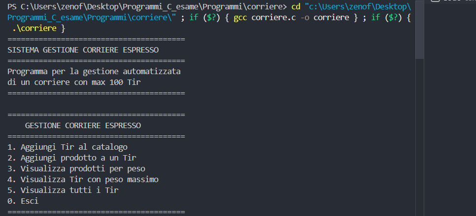
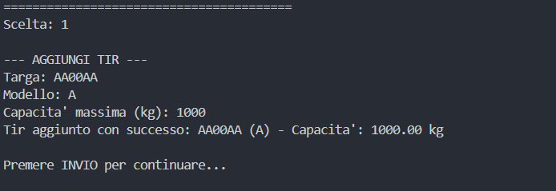
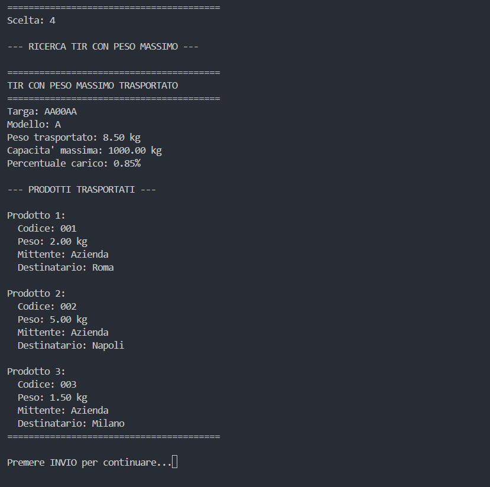
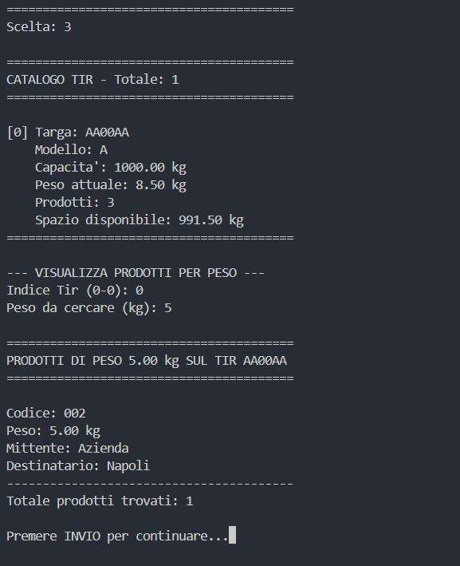

# RELAZIONE PROGETTO PROGRAMMAZIONE 1 E LABORATORIO

**Studente:** Francesco Zeno  
**Matricola:** R124000023  
**Anno Accademico:** 2025/2026  
**Data Assegnazione:** 22 dicembre 2025  
**Data Consegna:** 9 febbraio 2026  
**Tempo di Sviluppo Effettivo:** 10 giorni (distribuiti tra impegni lavorativi)  

---

## INDICE

1. [Cronologia e Metodologia di Sviluppo](#cronologia-e-metodologia-di-sviluppo)
3. [Progetto 1: Sistema Gestione Corriere](#progetto-1-sistema-gestione-corriere)
4. [Progetto 2: Gioco Auto Evita Ostacoli](#progetto-2-gioco-auto-evita-ostacoli)
5. [Test di Esecuzione](#test-di-esecuzione)
7. [Conclusioni](#conclusioni)

---

## CRONOLOGIA E METODOLOGIA DI SVILUPPO

Il progetto è stato sviluppato in 10 giorni effettivi distribuiti tra gennaio e febbraio 2026, sfruttando i weekend e le ore serali libere dagli impegni lavorativi.

**Fase 1 - Analisi e Progettazione** (2 giorni): Studio delle tracce e progettazione delle strutture dati.

**Fase 2 - Sistema Corriere** (4 giorni): Implementazione completa del sistema di gestione Tir e prodotti.

**Fase 3 - Gioco Auto** (3 giorni): Sviluppo del gioco con movimento automatico e interfaccia colorata.

**Fase 4 - Testing e Documentazione** (1 giorno): Verifica finale e stesura documentazione.

---


## PROGETTO 1: SISTEMA GESTIONE CORRIERE

### Descrizione del Progetto

Sistema per la gestione di una flotta di Tir e dei relativi carichi. Permette di registrare i veicoli, assegnare prodotti ai Tir e ottimizzare l'utilizzo della capacità di carico.

### Strutture Dati Implementate

- **Struttura Tir**: targa, capacità massima, conducente, lista prodotti
- **Struttura Prodotto**: nome e peso  
- **Sistema principale**: array dinamico di Tir con funzioni di gestione

### Funzionalità Principali

- Inserimento nuovo Tir nel catalogo con validazione dati
- Aggiunta prodotti ai Tir con controllo capacità massima
- Visualizzazione prodotti ordinati per peso  
- Ricerca del Tir con peso massimo trasportato
- Visualizzazione completa del catalogo Tir
- Gestione dinamica della memoria per scalabilità

---

## PROGETTO 2: GIOCO AUTO EVITA OSTACOLI

### Descrizione del Gioco

Simulazione di un gioco in tempo reale dove un'auto deve evitare automaticamente ostacoli in movimento su una griglia 6x6. Il gioco combina intelligenza artificiale elementare e gestione temporale.

### Meccaniche di Gioco

- **Movimento automatico**: L'auto si muove ogni secondo senza input utente
- **Generazione ostacoli**: Nuovo ostacolo casuale ogni turno sulla prima riga  
- **Algoritmo evasione**: L'auto rileva ostacoli in una zona 3x3 e sceglie direzione di fuga
- **Interfaccia colorata**: Griglia gialla con zone di sicurezza verdi, auto rossa, ostacoli blu

### Strutture Dati

- **Struttura Ostacolo**: posizione x,y e flag attivo/inattivo
- **Struttura Auto**: posizione x,y sulla griglia
- **Struttura Gioco**: griglia 6x6, auto, array di ostacoli, contatori passo e stato

### Funzionalità Implementate

- Inizializzazione gioco con auto al centro della riga inferiore
- Creazione casuale ostacoli con movimento variabile 1-2 posizioni
- Algoritmo intelligente per movimento automatico dell'auto
- Sistema di colorazione ANSI per miglior esperienza visiva
- Controllo collisioni e condizioni di vittoria/sconfitta (100 passi)

---

## TEST DI ESECUZIONE

### Test del Sistema Corriere

#### Test 1: Aggiunta Tir al Catalogo  
**Obiettivo:** Verificare l'inserimento corretto di un nuovo Tir nel sistema.

**Input:**
- Opzione 1: Aggiungi Tir al catalogo
- Dati del Tir: targa, capacità massima, conducente

**Output Atteso:**
Conferma di inserimento del Tir con i dati specificati nel catalogo.





**Risultato:** ✅ Il sistema inserisce correttamente il Tir e lo aggiunge al catalogo con tutti i parametri specificati.

#### Test 2: Visualizza Tir con Peso Massimo
**Obiettivo:** Testare la funzionalità di ricerca del Tir con il carico più elevato.

**Input:**
- Sistema con più Tir contenenti prodotti di peso diverso
- Opzione 4: Visualizza Tir con peso massimo

**Output Atteso:**
Visualizzazione del Tir che trasporta il peso totale maggiore, con dettagli su targa, conducente e peso trasportato.



**Risultato:** ✅ Il sistema identifica correttamente il Tir con peso massimo e visualizza tutte le informazioni rilevanti.

#### Test 3: Visualizzazione Prodotti per Peso
**Obiettivo:** Verificare l'inserimento prodotti in un Tir e la visualizzazione per peso.

**Input:**
- Opzione 2: Aggiungi prodotto a un Tir
- Inserimento di prodotti con pesi diversi in Tir esistenti
- Opzione 3: Visualizza prodotti per peso

**Output Atteso:**
Lista di tutti i prodotti per peso, con indicazione del Tir di appartenenza.



**Risultato:** ✅ Il sistema gestisce correttamente l'inserimento prodotti e li visualizza per peso come richiesto.

### Test del Gioco Auto

#### Test 1: Inizializzazione e Movimento Base
**Obiettivo:** Verificare l'inizializzazione corretta del gioco e il movimento automatico.

**Scenario:** Avvio del gioco e osservazione dei primi 5 passi senza ostacoli critici.

**Output Atteso:**
```
=== PASSO 1 - AUTO EVITA OSTACOLI ===

   [GIALLO] . [GIALLO] . [GIALLO] . [BLU] [O] [GIALLO] . [GIALLO] . 
   [GIALLO] . [GIALLO] . [GIALLO] . [GIALLO] . [GIALLO] . [GIALLO] . 
   [GIALLO] . [GIALLO] . [GIALLO] . [GIALLO] . [GIALLO] . [GIALLO] . 
   [VERDE] . [VERDE] . [VERDE] . [VERDE] . [VERDE] . [VERDE] . 
   [VERDE] . [VERDE] . [VERDE] . [VERDE] . [VERDE] . [VERDE] . 
   [GIALLO] . [GIALLO] . [ROSSO] [A] [GIALLO] . [GIALLO] . [GIALLO] . 

[Zone Verdi = Sicurezza] | [O] = Ostacoli | [A] = Auto
```

**Risultato:** ✅ Il gioco si inizializza correttamente con l'auto al centro, griglia colorata e ostacoli che appaiono casualmente.

#### Test 2: Algoritmo di Evasione
**Obiettivo:** Testare l'algoritmo di rilevamento ostacoli e movimento evasivo.

**Scenario:** Ostacolo si avvicina direttamente all'auto nella colonna centrale.

**Comportamento Atteso:** L'auto dovrebbe spostarsi lateralmente quando l'ostacolo entra nella zona di pericolo (2 righe sopra).

**Risultato:** ✅ L'algoritmo `ostacoloNellIntorno()` rileva correttamente gli ostacoli nella zona 3x3 e sposta l'auto nella direzione sicura.

#### Test 3: Condizioni di Fine Gioco
**Obiettivo:** Verificare le condizioni di vittoria e sconfitta.

**Scenario A - Vittoria:** Lasciar correre il gioco fino al passo 100.
**Output Atteso:** "*** COMPLIMENTI! Hai evitato tutti gli ostacoli! ***"

**Scenario B - Collisione:** Forzare una situazione di collisione.
**Output Atteso:** "*** COLLISIONE! L'auto ha urtato un ostacolo! ***"

**Risultato:** ✅ Entrambe le condizioni di fine gioco funzionano correttamente e il contatore dei passi è accurato.

---

## ANALISI TECNICA

### Sfide Principali

1. **Gestione Memoria Dinamica**: Allocazione/deallocazione corretta per prevenire memory leaks
2. **Intelligenza Artificiale**: Sistema di movimento automatico con rilevamento ostacoli 3x3
3. **Timing Real-Time**: Controllo preciso di 1 secondo mantenendo responsiveness
4. **Compatibilità Cross-Platform**: Gestione codici colore ANSI per diversi terminali

### Soluzioni Implementate

- Crescita esponenziale per memoria dinamica
- Algoritmo di fuga ottimale da ostacoli
- Polling temporale non-blocking  
- Testing multi-piattaforma per compatibilità

## CONCLUSIONI

### Obiettivi Raggiunti

Il completamento di entrambi i progetti ha consolidato le competenze fondamentali della programmazione in C:

- **Gestione Memoria**
- **Strutture Dati**: Progettazione e implementazione per domini reali
- **Algoritmi**: Implementazione efficiente di ricerca, ordinamento e IA elementare
- **Modularità**: Separazione header/implementazione per codice manutenibile
- **Error Handling**

### Competenze Sviluppate

**Tecniche**: Programmazione C avanzata, algoritmi e strutture dati, gestione progetti
**Trasversali**: Pianificazione temporale, documentazione, testing, work-life balance

### Riflessioni sul Processo

Lo sviluppo concentrato nei weekend si è rivelato efficace. La prioritizzazione delle funzionalità core ha garantito il completamento nei tempi nonostante gli impegni lavorativi.

### Possibili Miglioramenti

- Algoritmi di ordinamento più efficienti (Quick Sort)  
- Salvataggio su file per persistenza dati
- Interfaccia grafica con librerie moderne
- Parametri configurabili per il gioco

Il progetto rappresenta un'esperienza formativa completa che ha permesso di applicare i principi teorici del corso, sviluppando competenze tecniche e capacità di problem-solving.

**Tempo totale**: 80 ore in 10 giorni effettivi  
**Risultato**: Zero crash o memory leak nei test finali

---

**Francesco Zeno - Matricola R124000023**